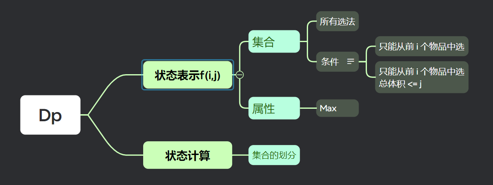
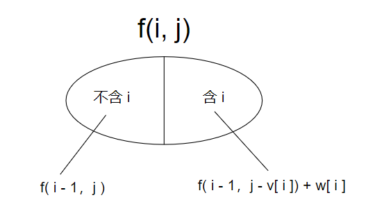
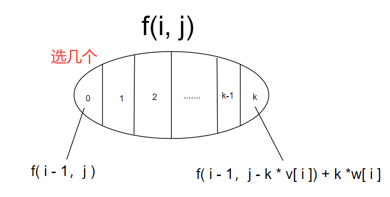
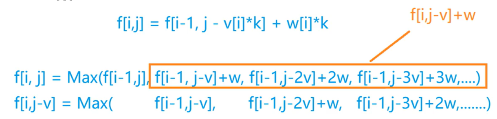
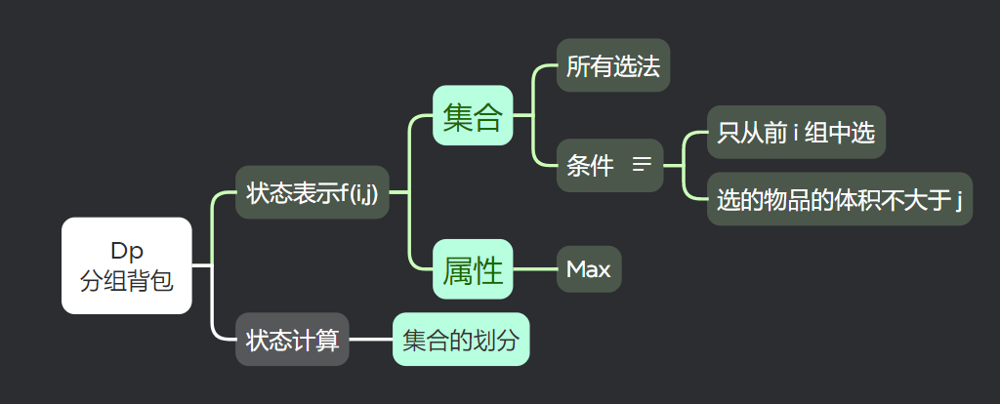
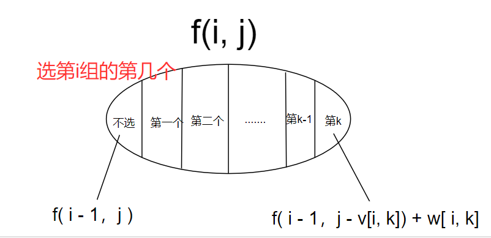

# 背包问题

**v：体积数组**

**w：价值数组**

# 1、01背包问题

**特点：每种物品只能拿一次**

## Dp问题抽象建模：



**集合**：所有满足2个条件的所有选法，即从 i 个物品选择体积 <= j 的所有选择

**属性**：在集合内所有选法的总价值的==最大值==

**状态表示f(i，j)**：从前 i 个物品中选择总体积 <= j 的选法的总价值的最大值

**集合划分**：


$$
f(i,j) = max( f(i-1,j), f(i-1, j-v[i]) + w[i]   )
$$

## C++实现

[ACWing题目链接](https://www.acwing.com/problem/content/2/)

```cpp
#include <iostream>
using namespace std;

const int N = 1010;
int v[N], w[N], f[N][N];
int n, m;

int main()
{
    cin >> n >> m;
    
    for(int i = 1; i <= n; i++)
    {
        cin >> v[i] >> w[i];
    }
    
    for(int i = 1; i <= n; i++){
        for(int j = 1; j <= m; j++)
        {
            f[i][j] = f[i-1][j];
            if(j >= v[i])   f[i][j] = max(f[i][j], f[i-1][j-v[i]] + w[i]);
        }
    }
    
    cout << f[n][m] << endl;
    return 0;
}
```


## 优化

核心代码是：

```cpp
for(int i = 1; i <= n; i++){
   for(int j = 1; j <= m; j++)
   {
        f[i][j] = f[i-1][j];
        if(j >= v[i])   f[i][j] = max(f[i][j], f[i-1][j-v[i]] + w[i]);
    }
}
```

遍历到第`i`层时，当前层只与上层相关，即`i-1`层。那么我们可以利用滚动数组的思想，压缩为一维数组`f[j]`来保存容量为`j`时的最大价值

在一维数组的优化中，状态转移方程仍然相同：

```cpp
dp[j] = max(dp[j], dp[j - v[i]] + w[i]);
```

为了避免当前状态覆盖掉上一层状态，需要从后向前更新数组

```cpp
for(int i = 1; i <= n; i++){
   for(int j = m; j >= v[i]; j--)
   {
        f[j] = max(f[j], f[j - v[i]] + w[i]);
    }
}
```

# 2、完全背包

**特点：每种物品有无限个**

## Dp问题抽象建模：

**状态表示和01背包相同，集合划分不一样**

**集合划分：**


$$
f(i,j) = max(f(i - 1，j-k × v[i]) + k × w[i])，k = 0， 1，2，...，k <= j/v[i]
$$

## 优化



故动态转移方程变为：
$$
f(i,j) = max(f[i-1, j]，f[i,j-v[i]] + w[i])
$$
核心代码如下：

```cpp
    for(int i = 1; i <= n; i++){
        for(int j = 1;j <= m; j++)
        {
            f[i][j] = f[i-1][j];
            if(j >= v[i])
                f[i][j] = max(f[i][j], f[i][j-v[i]] + w[i]);
        }
    }
```

可以再进一步做优化，用01背包滚动数组的思想，**从前往后递推**：

```cpp
    for(int i = 1; i <= n; i++){
        for(int j = v[i];j <= m; j++)
        {
            f[j] = max(f[j], f[j-v[i]] + w[i]);
        }
    }
```


## 实现

[ACWing题目链接](https://www.acwing.com/problem/content/3/)

```cpp
#include <iostream>
using namespace std;

const int N = 1010;
int v[N], w[N], f[N];
int n, m;

int main()
{
    cin >> n >> m;
    
    for(int i = 1; i <= n; i++)
    {
        cin >> v[i] >> w[i];
    }
    
    for(int i = 1; i <= n; i++){
        for(int j = v[i];j <= m; j++)
        {
            f[j] = max(f[j], f[j-v[i]] + w[i]);
        }
    }
    
    cout << f[m] << endl;
    return 0;
}
```


# 3、多重背包

**特点：每种物品最多有==s<sub>i</sub>==个**

## Dp问题抽象建模

思路基本和完全背包一样。

**暴力写法：**

```cpp
    for(int i = 1; i <= n; i++){
        for(int j = 1;j <= m; j++)
        {
            f[i][j] = f[i-1][j];
            for(int k = 1; k <= s[i] && k*v[i] <= j; k++)
            {
                f[i][j] = max(f[i][j], f[i-1][j-k*v[i]] + k*w[i]);
            }
        }
    }
```

## 优化

每个物品有一个数量限制，即一个物品有限次选择。该问题可以通过将多重背包转化为01背包来优化空间复杂度和时间复杂度，利用**二进制优化**。

### 二进制优化原理：

多重背包问题通过**二进制拆分**来转化为01背包问题。

对于一个物品 `i`，其数量限制为 `num[i]`，可以将其拆分为若干个物品，使得每个物品的数量都是2的幂（1, 2, 4, 8,...）。这样，最多需要用 `O(log(num[i]))` 个物品来表示物品 `i` 的数量约束。其核心思想是用较少的物品组合来表示该物品的可选次数，从而将多重背包问题转化为多个01背包问题进行求解。

#### 拆分方法：

对于物品 `i`，假设数量为 `num[i]`，可以拆分成以下几组：

- 1 个重量为 `weight[i]`、价值为 `value[i]` 的物品
- 2 个重量为 `2 * weight[i]`、价值为 `2 * value[i]` 的物品
- 4 个重量为 `4 * weight[i]`、价值为 `4 * value[i]` 的物品
- ...

最后，当剩余的物品数量不足2的幂时，直接将剩余的物品作为一组。

例如，如果 `num[i] = 13`，可以拆分为：

- 1 个重量为 `weight[i]`、价值为 `value[i]` 的物品
- 2 个重量为 `2 * weight[i]`、价值为 `2 * value[i]` 的物品
- 4 个重量为 `4 * weight[i]`、价值为 `4 * value[i]` 的物品
- 剩下的 `6` 个重量为 `6 * weight[i]`、价值为 `6 * value[i]` 的物品

这样，可以用少量的物品来代表多重背包中的每个物品，进而将问题转换为**01背包问题**

## 实现

[ACWing题目链接](https://www.acwing.com/problem/content/5/)

```cpp
#include<iostream>
#include<algorithm>
using namespace std;

const int N = 1e6+10;
int cnt;
int v[N], w[N];
int n,m;
int f[N];
int main()
{
    cin >> n >> m;
    for(int i = 1;i<=n;i++)
    {
        int k = 1;
        int a,b,c;
        cin >> a >> b >> c;
        while(k<=c)
        {
            cnt++;
            v[cnt] = a*k;
            w[cnt] = b*k;
            c -= k;
            k *= 2;
        }
        if(c>0)
        {
            cnt++;
            v[cnt] = a*c;
            w[cnt] = b*c;
        }
    }
    n = cnt;
    
    for(int i = 1;i<=n;i++)
        for(int j = m;j>=v[i];j--)
            f[j] = max(f[j], f[j-v[i]] + w[i]);
            
    cout << f[m] <<endl;
    return 0;
}
```

# 4、分组背包

**特点：每组有若干个，同一组内的物品最多只能选一个**

## Dp问题抽象建模



这里条件变了，变成只从前`i`组选，其余不变。

**集合划分**：



## 实现

[ACWing题目链接](https://www.acwing.com/problem/content/9/)

```cpp
#include <iostream>
using namespace std;

const int N = 110;
int s[N], v[N][N], w[N][N], f[N][N];
int n, m;

int main()
{
    cin >> n >> m;
    
    for(int i = 1; i <= n; i++){
        cin >> s[i];
        for(int j  = 1; j <= s[i]; j++)
            cin >> v[i][j] >> w[i][j];
    }
    
    for(int i = 1; i <= n; i++)
    {
        for(int j = 1; j <= m; j++)
        {
            f[i][j] = f[i-1][j];
            for(int k = 1; k <= s[i]; k++)
            {
                if(j >= v[i][k])
                    f[i][j] = max(f[i][j], f[i-1][j - v[i][k]] + w[i][k]);
            }
        }
    }
    cout << f[n][m] << endl;
    return 0;
}
```

