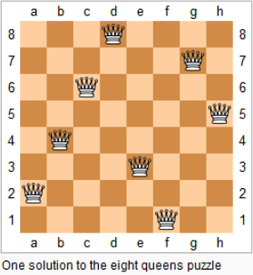

## 1、DFS和BFS

|      | 数据结构 |       空间       |                  |
| :--: | :------: | :--------------: | :--------------: |
| DFS  |  stack   |       O(N)       | 不具有最短路性质 |
| BFS  |  queue   | O(N2) |    最短路性质    |

* 回溯
* 剪枝

### n皇后

> n−n−皇后问题是指将 nn 个皇后放在 n×nn×n 的国际象棋棋盘上，使得皇后不能相互攻击到，即任意两个皇后都不能处于同一行、同一列或同一斜线上。

> 现在给定整数 nn，请你输出所有的满足条件的棋子摆法。