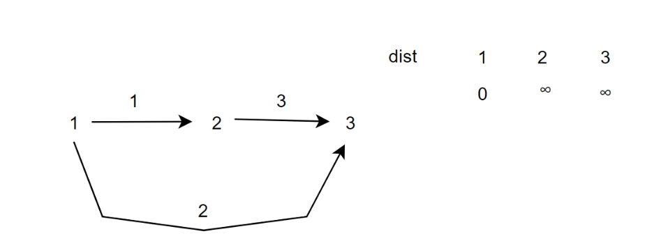
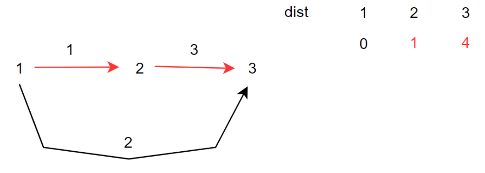

[TOC]

## 最短路算法归纳


==最短路问题==：**最短路问题**是图论中的经典问题，旨在寻找从一个顶点到其他顶点的最短路径。

==单源最短路==：给定一个源点（起点），找到从该源点到图中其他所有顶点的最短路径。

==多源汇最短路径==：给定多个源点，寻找从这些源点到一个目标（汇点）的最短路径。

## 朴素Dijkstra算法

### 基本思想

* Dijkstra算法使用==“贪心”==的思想，即每次都选择当前距离最小的顶点进行扩展，确保从起点到这个顶点的最短路径已经确定。
* 然后，通过该顶点尝试更新其邻接点的距离。
* 重复这一过程，直到所有顶点的最短路径都得到确定。

### 算法步骤

1. 初始化：
   * 设置一个距离数组`dist[]`，其中`dist[i]`表示从起点到顶点`i`的当前最短路径长度。起点的距离设为`0`，其余所有顶点的距离初始化为`∞`（无穷大）。
   * 设置一个已访问集合`S`，初始时包含起点，表示这些顶点的最短路径已确定。

2. 从起点开始：
   * 每次从未访问的顶点中选择一个距离当前最短的顶点`u`，将其加入到集合`S`中。
   * 对`u`的所有邻接顶点`v`进行松弛操作（Relaxation），尝试通过`u`更新`v`的最短距离。如果`dist[u] + weight(u, v) < dist[v]`，则更新`dist[v]`。
3. 重复：
   * 重复步骤2，直到所有顶点的最短路径都已确定。

### C++实现

[ACWing算法题链接](https://www.acwing.com/problem/content/851/)

```c++
#include <iostream>
#include <cstring>

using namespace std;

// 常量定义：N为顶点最大数量
const int N = 510；
// g[N][N]表示邻接矩阵，存储两点之间的边权
int g[N][N];
// dist[N]表示从起点1到每个点的最短距离
int dist[N];
// st[N]是状态数组，st[i]为true表示节点i已经确定最短路径
bool st[N];
// n为顶点数量，m为边的数量
int n, m;

/**
 * @brief Dijkstra算法，用于计算从节点1到节点n的最短路径
 * 
 * @return 如果存在从节点1到节点n的路径，返回最短路径长度；否则返回-1表示无法到达。
 */
int dijkstra()
{
    // 初始化dist数组，所有距离设置为一个非常大的值（无穷大）
    memset(dist, 0x3f, sizeof dist);
    
    // 起点1的距离初始化为0，因为从自己到自己的距离为0
    dist[1] = 0;
    
    // 遍历n-1次，每次确定一个顶点的最短路径
    for (int i = 1; i < n; i++)
    {
        // t用于记录当前未确定最短路径顶点中距离最小的顶点
        int t = -1;
        // 在所有顶点中，找到未确定最短路径且距离最小的顶点
        for (int j = 1; j <= n; j++)
        {
            // 如果节点j未被访问且距离小于当前已知最小距离，则更新t
            if (!st[j] && (t == -1 || dist[j] < dist[t]))
                t = j;
        }
        
        // 标记顶点t已经确定最短路径
        st[t] = true;
        
        // 松弛操作：尝试通过顶点t更新其他顶点的最短距离
        for (int j = 1; j <= n; j++)
            dist[j] = min(dist[j], dist[t] + g[t][j]);
    }
    
    // 如果从1号顶点到n号顶点的最短路径不是无穷大，则返回该距离，否则返回-1表示无法到达
    return dist[n] != 0x3f3f3f3f ? dist[n] : -1;
}

int main()
{
    cin >> n >> m;
    
    // 初始化邻接矩阵，所有边的权值初始化为无穷大（表示两点之间不存在边）
    memset(g, 0x3f, sizeof g);
    
    for (int i = 0; i < m; i++)
    {
        int a, b, w;
        cin >> a >> b >> w;
        // 如果存在重边，则会读取最短的那条边
        g[a][b] = min(g[a][b], w);
    }
    
    cout << dijkstra() << endl;
    
    return 0;
}
```


## 堆优化版本的Dijkstra算法

### 基本思想

==朴素版的Dijsktra算法适合稠密图，边的数量与算法时间复杂度无关，都为O(N^2)==

那么如果是稀疏图呢（边的数量`E`远小于`N^2`）？则优先使用改进的Dijkstra算法。

> 在朴素版的Dijkstra算法中，**在所有顶点中，找到未确定最短路径且距离最小的顶点**的时间复杂度为O(N)，那么我们可以通过优
>
> 化这一步骤来提高效率。

我们可以利用就要利用==堆==来获取**距离最小的顶点**，时间复杂度为O(1)，而调整堆的时间复杂度为O(log(N))。

* 知识补充，C++优先队列的基本用法：

```c++
 priority_queue<int, vector<int>, greater<int>> pq; // 使用std::greater<T>实现小根堆
 priority_queue<int, vector<int>, less<int>> pq; // 使用std::greater<T>实现大根堆
```

### C++实现

[ACwing算法题链接](https://www.acwing.com/problem/content/852/)

```c++
#include <iostream>
#include <queue>
#include <cstring>
using namespace std;

// 定义常量和类型
typedef pair<int, int> PII; // PII表示一对整数，first为距离，second为顶点编号
const int N = 150010; // N为最大顶点数量

// 图的邻接表结构
int h[N], e[N], ne[N], w[N], idx; // h[N]存储头结点，e[N]存储边的目标顶点，ne[N]存储下一条边的索引，w[N]存储边的权重
int dist[N]; // dist[N]存储从起点到各点的最短距离
bool st[N]; // st[N]标记顶点是否已确定最短路径
int n, m; // n为顶点数量，m为边的数量

/**
 * @brief 添加一条边到邻接表中
 * @param a 边的起点
 * @param b 边的终点
 * @param c 边的权重
 */
void add(int a, int b, int c)
{
    e[idx] = b;        // 记录目标顶点
    ne[idx] = h[a];    // 记录当前顶点的下一条边
    w[idx] = c;        // 记录边的权重
    h[a] = idx++;      // 更新顶点的头指针
}

/**
 * @brief Dijkstra算法，计算从起点1到终点n的最短路径
 * @return 返回最短路径长度，如果无路径则返回-1
 */
int Dijkstra()
{
    // 初始化dist数组，设置所有点到起点的距离为一个非常大的值（0x3f3f3f3f相当于无穷大）
    memset(dist, 0x3f, sizeof dist);
    
    // 起点1的距离初始化为0
    dist[1] = 0;
    // 定义优先队列，使用最小堆（greater<PII>）以确保每次取出的是最小距离的顶点
    priority_queue<PII, vector<PII>, greater<PII>> queue;
    
    // 将起点1推入优先队列，起点距离为0
    queue.push({0, 1});
    
    // 开始处理队列
    while (!queue.empty())
    {
        // 取出距离最小的顶点（当前优先队列中的堆顶元素）
        auto t = queue.top();
        queue.pop();
        
        int distance = t.first; // 顶点t的当前距离
        int id = t.second;      // 顶点编号
        
        // 如果该顶点已经处理过，跳过
        if (st[id])  
            continue;
        
        // 标记该顶点已确定最短路径
        st[id] = true;
        
        // 遍历与当前顶点相连的所有边
        for (int i = h[id]; i != -1; i = ne[i])
        {
            int j = e[i]; // 边的终点
            
            // 松弛操作：如果通过当前顶点可以使邻接顶点j的距离更短，则更新
            if (dist[j] > distance + w[i]) {
                dist[j] = distance + w[i]; // 更新顶点j的最短距离
                queue.push({dist[j], j});  // 将更新后的顶点推入优先队列
            }
        }
    }
    
    // 如果终点n的最短路径不是无穷大，返回该路径，否则返回-1表示无路径
    return dist[n] != 0x3f3f3f3f ? dist[n] : -1;
}

int main()
{
    // 初始化邻接表，所有顶点的头指针初始为-1（表示没有边）
    memset(h, -1, sizeof h);
    
    // 读取顶点数和边数
    cin >> n >> m;
    
    // 逐条读取边的信息，并将其添加到邻接表中
    while (m--)
    {
        int a, b, c;
        cin >> a >> b >> c;
        add(a, b, c); // 将边(a, b, c)添加到邻接表
    }
    
    cout << Dijkstra() << endl;
    
    return 0;
}
```

## Bellman-Ford算法

### 基本思想

**Bellman-Ford**算法与**Dijkstra**算法相似，都是从一个起始点开始，逐步寻找到所有其他点的最短路径。

与**Dijkstra**不同的是，它可以处理带有负权边的图。其核心思想是对所有边进行多次==松弛（Relaxation）==，逐步缩短每个顶点的最短路径估计值。

### 特性

1. 能够处理负权边，这是区别于**Dijkstra**的关键点
2. 能够检测负环：如果在`n-1`次松弛操作后，还能进一步松弛边，则说明图中存在负权环。

### 算法步骤

1. **初始化**：
   * 设置一个距离数组`dist[]`，其中`dist[i]`表示从起点到顶点`i`的当前最短路径长度。起点的距离设为`0`，其余所有顶点的距离初始化为`∞`（无穷大）。
   * 设置一个已访问集合`S`，初始时包含起点，表示这些顶点的最短路径已确定。

2. **松弛操作**：

   * 遍历n次，**都需要对上一次的距离信息进行备份**，然后遍历==所有边==。
   * 对于每条边`(u, v)`，如果`dist[v] > dist[u] + w(u, v)`，则更新`dist[v]`。

   **为什么要进行备份？**

   >  备份机制确保每一轮松弛时，所有的更新操作是基于上一轮的结果，而不是当前已经被更新的值。
   >
   >  这样可以保证每一轮松弛时，所有边的松弛操作都是在同一轮次内完成的，避免出现松弛操作相互影响的情况。

   

   > 假设有现在这种情况(无备份模式)，dist数组分别是0，∞，∞
   >
   > 在第一次松弛操作时，当遍历前两条边时会出现下面的情况
   
   
   
   

   > 1-->3 出现了一条边数为2的路线，而在此算法中，第k次松弛操作意味着可以从某一起点和终点找到一条不大于k条边的路线。
   >
   > 故需要备份操作。

### C++实现

[ACWing算法题链接](https://www.acwing.com/problem/content/description/855/)

```c++
#include <iostream>
#include <cstring>
using namespace std;

const int N = 510, M = 100010;  // 定义最大节点数N和最大边数M
int dist[N], backup[N];         // dist数组存储源点到各个节点的最短距离，backup用于保存上一次的距离信息
bool st[N];                     // 标记数组，用于判断节点是否在队列中，虽然这里没有用到
int n, m, k;                    // n表示节点数量，m表示边数，k表示最多进行k次松弛操作

// 边的结构体，表示有向边u->v，权值为w
struct Edge{
    int u;
    int v;
    int w;
} Edges[M];                     // 定义边的数组，存储图中的所有边

// Bellman-Ford算法实现
void bellman_ford()
{
    memset(dist, 0x3f, sizeof dist);  // 初始化dist数组，设置为正无穷，0x3f3f3f3f是较大的整数（近似于无穷大）
    
    dist[1] = 0;                      // 设置源点到自身的距离为0，假设源点为1
    
    // 进行k次松弛操作，每次更新所有边
    for(int i = 0; i < k; i++)
    {
        memcpy(backup, dist, sizeof dist);  // 将当前的dist数组复制到backup中，便于后续的松弛操作
        
        // 遍历所有边，进行松弛操作
        for(int j = 0; j < m; j++){
            int u = Edges[j].u;
            int v = Edges[j].v;
            int w = Edges[j].w;
            
            // 松弛操作，如果从u到v的路径经过u再加上权值w比当前到v的路径更短，则更新v的距离
            dist[v] = min(dist[v], backup[u] + w);
        }
    }
    
    // 如果经过k次松弛后，目标节点的距离仍然是无穷大，说明无法到达
    if(dist[n] > 0x3f3f3f3f / 2)    printf("impossible\n");
    else    cout << dist[n] << endl;  // 否则输出从源点到目标节点n的最短距离
}

int main()
{
    cin >> n >> m >> k;  // 输入节点数n，边数m，松弛次数k
    
    // 输入每条边的信息，存入Edges数组
    for(int i = 0; i < m; i++)
    {
        int u, v, w;
        cin >> u >> v >> w;
        Edges[i] = {u, v, w};  // 存储边u->v，权值为w
    }
    
    bellman_ford();  // 调用Bellman-Ford算法计算最短路径
    
    return 0;  // 程序结束
}
```


## SPFA

* SPFA 算法的核心思想是**松弛操作的队列优化**。

* 它并不需要像 Bellman-Ford 那样每次都松弛所有的边，而是将那些有可能继续松弛的节点放入队列中，进行有选择性的松弛。这样可以避免对不必要的节点进行多余的计算，大大加快算法的速度。

  > 在Bellman-Ford算法中，松弛操作的关键操作是dist[v] = min(dist[v], backup[u] + w);
  >
  > 大白话来讲就是：如果某一个节点的距离数组变小了，那么就需要将他放进队列里，与它关联的边进行松弛操作。边关联的节点接着放进队列。

### 算法步骤

### SPFA 算法的基本流程：

1. **初始化**：将源点的最短路径设置为 0，其他节点的最短路径设置为正无穷。
2. **队列操作**：将源点入队列，开始松弛过程。
3. **松弛操作**：
   * 每次从队列中取出一个节点，检查它的所有相邻节点。
   * 如果通过该节点可以更新相邻节点的最短路径，则更新，并将该相邻节点加入队列（如果它不在队列中）。
4. **循环处理**：重复上述过程，直到队列为空，意味着所有可能的最短路径都已经被处理过。

### C++实现

[ACWing算法题链接](https://www.acwing.com/problem/content/853/)

```c++
#include <iostream>
#include <cstring>
#include <queue>
using namespace std;

const int N = 100010;    // 定义常量N，表示最大节点数
int dist[N];             // 存储源点到各节点的最短距离
int h[N], e[N], ne[N], w[N], idx;  // 邻接表相关数组：h是每个点的头节点索引，e存储边的终点，ne存储下一条边的索引，w存储边权，idx是边的计数器
bool st[N];              // 标记数组，判断每个节点是否在队列中
int n, m;                // n是节点数，m是边数

// SPFA算法
void spfa()
{
    memset(dist, 0x3f, sizeof dist);  // 初始化最短距离数组，将所有节点的距离设为无穷大
    queue<int> que;                   // 定义队列，用于存储需要松弛的节点
    dist[1] = 0;                      // 设置源点（假设为1）的最短距离为0
    que.push(1);                      // 将源点入队
    st[1] = true;                     // 标记源点在队列中

    while (!que.empty()) {             // 当队列不为空时，继续松弛操作
        auto t = que.front();         // 取出队首节点
        que.pop();                    // 将该节点出队

        st[t] = false;                // 标记该节点已经出队

        // 遍历节点 t 的所有邻接边，进行松弛操作
        for (int i = h[t]; i != -1; i = ne[i]) {   // 遍历邻接表，通过ne[i]找到下一个邻接节点
            int v = e[i];              // 获取边的终点v
            if (dist[v] > dist[t] + w[i]) {   // 松弛操作：检查通过t到v的路径是否更短
                dist[v] = dist[t] + w[i];     // 如果更短，则更新dist[v]
                if (!st[v]) {                 // 如果v不在队列中，则将其加入队列
                    que.push(v);
                    st[v] = true;             // 标记v已经入队
                }
            }
        }
    }

    // 判断源点到节点n是否可达，若不可达输出"impossible"，否则输出最短路径
    if (dist[n] > 0x3f3f3f3f / 2) cout << "impossible" << endl;
    else cout << dist[n] << endl;
}

int main()
{
    cin >> n >> m;               // 输入节点数n和边数m
    memset(h, -1, sizeof h);     // 初始化邻接表的头节点数组h，-1表示该节点没有任何边

    // 输入每条边的起点、终点和权值
    for (int i = 0; i < m; i++) {
        int a, b, c;
        cin >> a >> b >> c;
        e[idx] = b;              // 将b存入e数组，表示边a -> b
        w[idx] = c;              // 将边权c存入w数组
        ne[idx] = h[a];          // 将当前边的下一个边设为节点a当前的第一条边
        h[a] = idx++;            // 更新节点a的头节点索引，并增加边的计数器
    }

    spfa();  // 调用SPFA算法计算最短路径

    return 0;
}
```

## Floyd算法

### 基本思想

Floyd-Warshall算法使用**动态规划**的思想，逐步更新顶点间的最短路径。它的主要步骤是：对于图中的每一对顶点`(i, j)`，通过所有可能的中间顶点`k`来尝试更新它们之间的最短路径。具体来说，如果通过顶点`k`能够让`i`到`j`的路径更短，则更新它们的最短路径。

### C++实现

[ACWing算法题链接](https://www.acwing.com/problem/content/856/)

```c++
#include <iostream>
#include <cstring>
using namespace std;

const int N = 210;
int g[N][N];
int n, m, k;

void floyd()
{
    for(int k = 1; k <=n; k++)
    {
        for(int i = 1; i <= n; i++)
        {
            for(int j = 1; j <= n; j++)
            {
                g[i][j] = min(g[i][j], g[i][k] + g[k][j]);
            }
        }
    }
}


int main()
{
    cin >> n >> m >> k;
    
    for(int i = 1; i<=n; i++)
    for(int j = 1; j <= n; j++){
        if(i == j)    
            g[i][j] = 0;
        else 
            g[i][j] = 0x3f3f3f3f;
    }
    
    while(m--)
    {
        int a, b, c;
        cin >> a >> b >> c;
        g[a][b] = min(g[a][b], c);
    }
    
    floyd();
    
    while(k--)
    {
        int x, y;
        cin >> x >> y;
        if(g[x][y] > 0x3f3f3f3f / 2)   cout <<"impossible" << endl;
        else    cout << g[x][y] << endl;
    }
    return 0;
}
```

