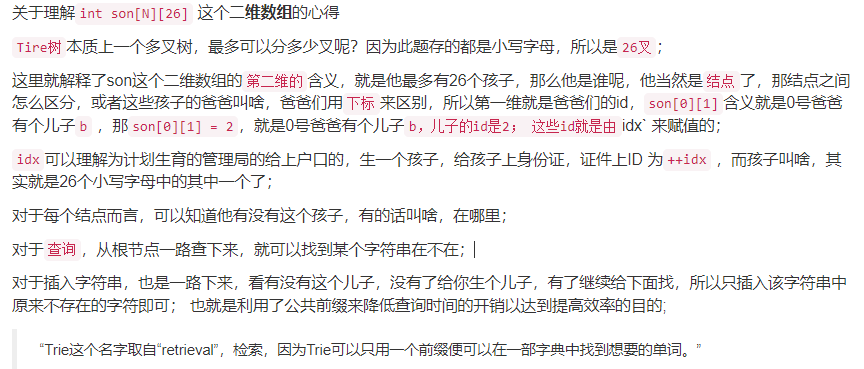
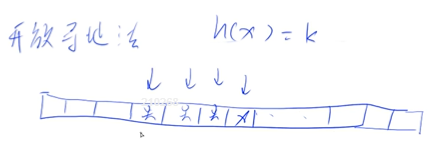

## 1、单链表

用数组来模拟链表

## 2、双链表

## 3、栈

## 4、队列

## 5、单调栈

### 题型：

>给定一个序列，找到序列中的每一个数左边离它最近且比它小的位置


### 思路：

> 给定一个i，如果a<sub>3</sub> >= a<sub>5</sub>，因为我们每次找的都是离i最近的小于i的数，那么意味着当i > 5
>
> 时，a<sub>3</sub>永远不会出现在答案中。
>
> 将可能的答案放进栈中，给定x, y，并且x < y，x可以被删掉，如果有逆序的关系存在，那	么前面的答案可以删去。
>
> 如此做，那么得到一个递增的栈（栈顶元素最大）。


### 算法具体步骤：

> 如果stk[ tt ] >= a[i]，栈顶可以删掉，直到栈顶元素小于a[i]，在栈中插入a[i]。那么就意味着·栈顶元素就是小于a[i]且离a[i]最近的点。

## 6、单调队列

### 题型：

求滑动窗口的最大值或者最小值

###  思路：

看一下哪些元素是没有用的，并且删掉，会不会得到单调性。


>现在找滑动窗口的最小值
>
>当指针指向-3时，那么意味着3，-1不会出现在答案中，他们两就可以在队列中删去。
>
>
>
>只要队列中存在序列对，可以把大的点删掉，就可以得到严格递增的队列

最小值为==队列头元素==。

## 7、KMP

## 8、Trie树

### 8.1 用途

* 高效地存储和查找字符串集合的数据结构

### 8.2 如何存储？


### 	8.3 数据结构的代表表示



```c++
const int N = 100010;
int son[N][26], cnt[N], idx; // 下标为0的点表示根节点

void insert(char str[])
{
    int p = 0;
    for(int i = 0; str[i]; i++)
    {
        int u = str[i] - 'a';
        if(!son[p][u]) son[p][u] = ++idx;
        p = son[p][u];
    }
    cnt[p]++;
}

int query(char str[])
{
    int p = 0;
    for(int i = 0; str[i]; i++)
    {
        int u = str[i] - 'a';
        if(!son[p][u]) return 0;
        p = son[p][u];
    }
    return cnt[p];
}
```

## 9、并查集

### 9.1 用途

1. 将两个集合合并
2. 询问两个元素是否一个集合当中

### 9.2 基本思想

每一个集合用一个树来维护，根节点就代表集合的编号，利用一个数组p[x]来存储每个点的父节点（根节点的父节点为自己）。


>  问题1：如何判断树根：==if(p[x] == x)==
>
> 问题2：如何求x的集合编号：==while(p[x] != x) x = p[x]==
>
> 问题3：如何合并：将某一个集合的根插入到另一个集合----> ==p[x] = y==；p[x]是x的集合编号，p[y]是y的集合编号。

### 9.3 路径压缩

1. 找到根节点


2. 将此路径上的所有节点直接插入根节点


### 9.4 核心操作（代码）

```c++
int find(int x) // 返回X的祖宗节点 + 路径压缩
{
    if(p[x] != x)	p[x] = find(p[x]);
    return p[x];
}
```


## 10、手写堆

### 10.1 基本概念

堆是一个完全二叉树

小根堆：每一个点都是小于等于左右儿子

### 10.2 基本问题

1. 插入一个数：  	  ==heap[++size] = x; 	up(size);==
2. 求集合中的最小值：==heap[1];==
3. 删除最小值：            ==heap[1] = heap[size]; size--; down(1);==
4. 删除任意一个元素：==heap[k] = heap[size];    size--;  down(k); up(k);==
5. 修改任意一个元素：==heap[k] = x;   down(k); up(k);==

### 10.3 存储方式

利用数组，下标为1是根节点，左儿子为2x，右二子为2x + 1。

### 10.4 基本操作

down(x)：把节点往上移

up(x)：把节点往下移

### 10.5 基本操作代码

```c++
void down(int u)
{
    int t = u;
    if(2 * u <= size && h[2 * u] < h[t])	t = 2 * u;
    if(2 * u + 1 <= size && h[2 * u + 1] < h[t])	t = 2 * u + 1;
    if(t != u){
        swap(h[u], h[t]);
        down(t);
    }
}

void up(int u)
{
    while(u / 2 && h[u/2] > h[u]){
        swap(h[u / 2], h[u]);
        u /= 2;
    }
}
```

## 11、哈希表

### 11.1 作用

把一个庞大的值域映射到较小的值域。

比如：0 ~ 10<sup>10</sup> -----》0 ~ 10<sup>5</sup> 

### 11.2 存储结构

1. 开放寻址法

   * 数组要开200003，h(x) = k，找第下标为k的数组，如果有就往后找

   * 

2. 拉链法

   * 取值为100003，h(11) = 3，h(23) = 3，在3后面拉链

     

### 11.3 算法思想

1. x mod 10<sup>5</sup>，==一般来说模的数字，要取成一个质数,冲突概率最小==
2. 冲突（根据处理冲突不同方式，分成开放寻址法和拉链法）

### 11.4 操作

1. 添加
2. 查找

### 11.5 存储结构的两种代码实现

#### 11.5.1 拉链法

```c++
const int N = 100003;
int h[N], e[N], ne[N], idx;

void insert(int x)
{
    int k = (x % N + N)% N;
    e[idx] = k;
    ne[idx] = h[k];
    h[k] = idx++;
}

bool find(int x)
{
    int k = (x % N + N ) % N;
    for(int i = h[k]; i != -1; i = ne[i])
    {
        if(e[i] == k)
            return true;
    }
    return false;
}
```

#### 11.5.2 开放寻址法

```c++
const int N = 200003, null = 0x3f3f3f3f;
int h[N];
memset(h, 0x3f, sizeof h);

// 返回x应该插入的位置
int find(int x)
{
    int k = (x % N + N) % N;
    while(h[k] != null && h[k] != x)
    {
        k++;
        if(k == N)	k = 0;
	}
    
    return k;
}

```

## 12、字符串前缀哈希

### 12.1 作用

给定一字符串str = "ABCSDAWFDSCAW";	先将它预处理

h[1] = "A"的哈希值

h[2] = "AB"的哈希值

h[3] = "ABCS"的哈希值

​    .....

1. 如何定义每一个前缀的哈希值？
   * 转化成p进制的数字
   * "ABCD" ---> "先把A看成1，B看成2，...."  = ==1 * p<sup>3</sup>  + 2 * p<sup>2</sup>  + 3 * p<sup>1</sup>  + 4 * p<sup>0</sup>==
   * 这个哈希值可能会非常大，需要取模，%Q
   * 通过这种操作，可以将一个字符串前缀映射到一个数字
   * ==注意：不能将字母映射成0==
   * ==这里的哈希不存在冲突==（假定人品足够牛逼
   * P = 131 或者 13331、Q = 2 <sup>64</sup>

2. 有什么好处？

   ==可以利用前缀哈希算出来任意一个字串的哈希值==

   

> 已知h[R]、h[L-1]，要求L-R这段的哈希值
>
> h[R] - h[L - 1] * p<sup>R-L+1</sup>

3. 如何预处理

   > h[i] = h[i -1 ] * p + str[i];
